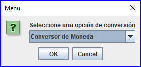

|  |  |
| :------------------------------------------: | :----------------------------------------------------: |
|  |  |
<h2>Challenge ONE - Oracle Next Education | Conversor de Moneda - Alura</h2>

Se solicitó crear un conversor de divisas utilizando el lenguaje Java. Hay características solicitadas.

<b>Requisitos:</b>
<ul>
<li>El conversor de moneda debe:</li>

      - Convertir de la moneda de tu país a Dólar
      - Convertir de la moneda de tu país a Euros
      - Convertir de la moneda de tu país a Libras Esterlinas
      - Convertir de la moneda de tu país a Yen Japonés
      - Convertir de la moneda de tu país a Won sur-Coreano 
Recordando que también debe ser posible convertir inversamente, es decir:

      - Convertir de Dólar a la moneda de tu país
      - Convertir de Euros a la moneda de tu país
      - Convertir de Libras Esterlinas a la moneda de tu país
      - Convertir de Yen Japonés a la moneda de tu país
      - Convertir de Won Sur-Coreano a la moneda de tu país
</ul>

Por ejemplo:

<pre>
"Conversor de Moneda" => "100"
"Dolar a Peso Argentinos" => "21746.0"
</pre>
<b>Extra:</b>
<ul>
<li>Posee la opción para convertir la temperatura Celsius (°C) <->	Fahrenheit (°F)</li>
</ul>
